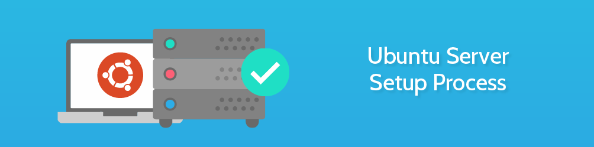

# server-setup
List of useful resources & commands i use to setup an ubuntu server



## Initial Ubuntu Setup
* [Initial Server Setup with Ubuntu 18.04](https://www.digitalocean.com/community/tutorials/initial-server-setup-with-ubuntu-18-04)
* [How to Set Up SSH Keys on Ubuntu 18.04](https://www.digitalocean.com/community/tutorials/how-to-set-up-ssh-keys-on-ubuntu-1804)

## Ensure which init system is being used
* Recent versions of Linux tend to use systemd (which uses the systemctl command), while older versions of Linux tend to use System V init (which uses the service command).
If you are unsure which init system your platform uses, run the following command:
```
ps --no-headers -o comm 1
```

## Check Running Processes
```bash
netstat -tulpn
```

## Update Server Timezone
```bash
dpkg-reconfigure tzdata # Update timezone interactively
service cron restart # need to restart cron service if you've updated timezones
timedatectl # Validate if set properly
```

## LAMP/LEMP
* [How To Install Linux, Nginx, MySQL, PHP (LEMP stack) on Ubuntu 18.04](https://www.digitalocean.com/community/tutorials/how-to-install-linux-nginx-mysql-php-lemp-stack-ubuntu-18-04)

## Nginx
* [How To Install Nginx on Ubuntu 18.04](https://www.digitalocean.com/community/tutorials/how-to-install-nginx-on-ubuntu-18-04)
* [Add Brotli support to Nginx on Ubuntu 18.04](https://www.vultr.com/docs/add-brotli-support-to-nginx-on-ubuntu-18-04)
* [How To Set Up Password Authentication with Nginx on Ubuntu 14.04](https://www.digitalocean.com/community/tutorials/how-to-set-up-password-authentication-with-nginx-on-ubuntu-14-04)

## Let's Encrypt
* [How To Secure Nginx with Let's Encrypt on Ubuntu 18.04](https://www.digitalocean.com/community/tutorials/how-to-secure-nginx-with-let-s-encrypt-on-ubuntu-18-04)
* [Secure Nginx with Let's Encrypt on Ubuntu 18.04](https://linuxize.com/post/secure-nginx-with-let-s-encrypt-on-ubuntu-18-04/)

Useful Commands
```bash
# To obtain a certificate
certbot --nginx -d weoneapp.com -d www.weoneapp.com

# To check renewal
certbot renew --dry-run

# To check all certificates
certbot certificates

# Certbot issues: once the certificate is auto renewed we also have to reload the nginx service.
sudo nano /etc/cron.d/certbot

0 */12 * * * root test -x /usr/bin/certbot -a \! -d /run/systemd/system && perl -e 'sleep int(rand(43200))' && certbot -q renew --renew-hook "sudo systemctl reload nginx"
```

## Composer
* [How To Install and Use Composer on Ubuntu 18.04](https://www.digitalocean.com/community/tutorials/how-to-install-and-use-composer-on-ubuntu-18-04)
```bash
composer install --optimize-autoloader --no-dev
```

## Wordpress
* [How To Install WordPress with LEMP on Ubuntu 18.04](https://www.digitalocean.com/community/tutorials/how-to-install-wordpress-with-lemp-on-ubuntu-18-04)
* [Integrating AWS S3 & Cloudfront With Wordpress](https://blog.lawrencemcdaniel.com/integrating-aws-s3-cloudfront-with-wordpress-2/)
* [Install WordPress with Ubuntu 18.04, NGINX, MariaDB and PHP 7.4](https://gulshankumar.net/install-wordpress-with-lemp-on-ubuntu-18-04/)
* [Setup Your Wordpress Site The Right Way](https://blog.lawrencemcdaniel.com/wordpress-enhancements/)

## NodeJS
* [Setting up an HTTPS site using Nodejs, AWS EC2, Nginx, Let's Encrypt, and Namecheap - Zeevo](https://shaneoneill.io/2018/10/21/setting-up-an-https-site-using-nodejs-aws-ec2-nginx-lets-encrypt-and-namecheap/)
* [How To Set Up a Node.js App for Production on Ubuntu 18.04](https://www.digitalocean.com/community/tutorials/how-to-set-up-a-node-js-application-for-production-on-ubuntu-18-04)

## PM2 Commands
```bash
# start & reload app with conf file
pm2 start ecosystem.config.js
pm2 reload ecosystem.config.js --update-env

# start & repload app without conf file
pm2 start app.js -i max --name example-api
pm2 reload app.js -i max --name example-api --update-env

# to auto start PM2 on System boot
pm2 startup

# to save the current running application state on system boot
pm2 save

# Install pm2-logrotate
pm2 install pm2-logrotate
```

## MongoDB
* [Install MongoDB Community Edition on Ubuntu — MongoDB Manual](https://docs.mongodb.com/manual/tutorial/install-mongodb-on-ubuntu/)

Useful Commands
```bash
Mongo config file : /etc/mongod.conf
Mongo Logs : /var/log/mongodb
Mongo Data Dir : /var/lib/mongodb

sudo systemctl start mongod
systemctl status mongod
mongod --port 27017 --dbpath /var/lib/mongodb

# If (code=exited, status=14)
chown -R mongodb:mongodb /var/lib/mongodb
chown mongodb:mongodb /tmp/mongodb-27017.sock

# Create user
> use admin
> db.createUser({user: "weOadmin",pwd: passwordPrompt(),roles:[{role: "userAdminAnyDatabase", db: "admin" },"readWriteAnyDatabase"]})
> db.createUser({user:'weOapi', pwd: passwordPrompt(), roles:[{db:'movies', role:'readWrite'}]})

# Import a single collection
> mongoimport --db movies --collection beta_users_list beta_users_list.json --username weOapi --password secretPassword

# Import a full dump
> mongorestore dump/ -u=weOapi

# Take DB Backup
> mongodump -d movies -o back_11_aug -u weOapi -p 'secretPassword'
> cd back_11_aug && tar -cvzf movies.tar.gz weone/
```

## Postgres
* [How To Install PostgreSQL on Ubuntu 20.04 [Quickstart]](https://www.digitalocean.com/community/tutorials/how-to-install-postgresql-on-ubuntu-20-04-quickstart)

## Redis
* [How To Install and Secure Redis on Ubuntu 18.04](https://www.digitalocean.com/community/tutorials/how-to-install-and-secure-redis-on-ubuntu-18-04)

Useful Commands
```bash
# Manage Service
systemctl status redis.service
systemctl start redis.service
systemctl stop redis.service
systemctl restart redis.service

# Update config
nano /etc/redis/redis.conf

# Use Password
redis-cli
auth <password>
```

## AWS EC2 Extending a Volume
* [Extending a Linux file system after resizing a volume - Amazon Elastic Compute Cloud](https://docs.amazonaws.cn/en_us/AWSEC2/latest/UserGuide/recognize-expanded-volume-linux.html)

## MySQL SSH Tunneling
* [Connecting to MySQL Remotely Using AutoSSH and SSH Tunneling](https://www.amplitudedesign.com/2018/11/connecting-to-mysql-remotely-using-autossh-and-ssh-tunneling/)
```bash
# DEBUGGING - YOU SHOULD SEE autossh sending a request every ServerAliveInterval seconds.
AUTOSSH_DEBUG=1 autossh -M 0 -N ubuntu@15.123.456.52 -o "ServerAliveInterval 10" -o "ServerAliveCountMax 3" -L 6666:localhost:3306 -vvv

ps aux | grep ssh # Check SSH process is running
ps aux | grep autossh # Check AutoSSH process is running

# Main command
autossh -f -M 0 -N ubuntu@15.123.456.52 -o "ServerAliveInterval 10" -o "ServerAliveCountMax 3" -C -L 3306:localhost:3306
```

## Cronjobs
```bash
crontab -l # For listing
crontab -e # For editing
```

## Configure logrotate for custom cron logs
```bash
nano /etc/logrotate.d/cronjobs
/var/log/cron-*.log {
    daily
    missingok
    rotate 10
    compress
    notifempty
    size 3M
}
```

## Contributions
Welcoming more setup instructions, resources & commands.

## Follow me at
<a href="https://github.com/dr5hn/"></a> <a href="https://twitter.com/dr5hn/"></a> <a href="https://www.linkedin.com/in/dr5hn/"></a>

That's all Folks. Enjoy.
